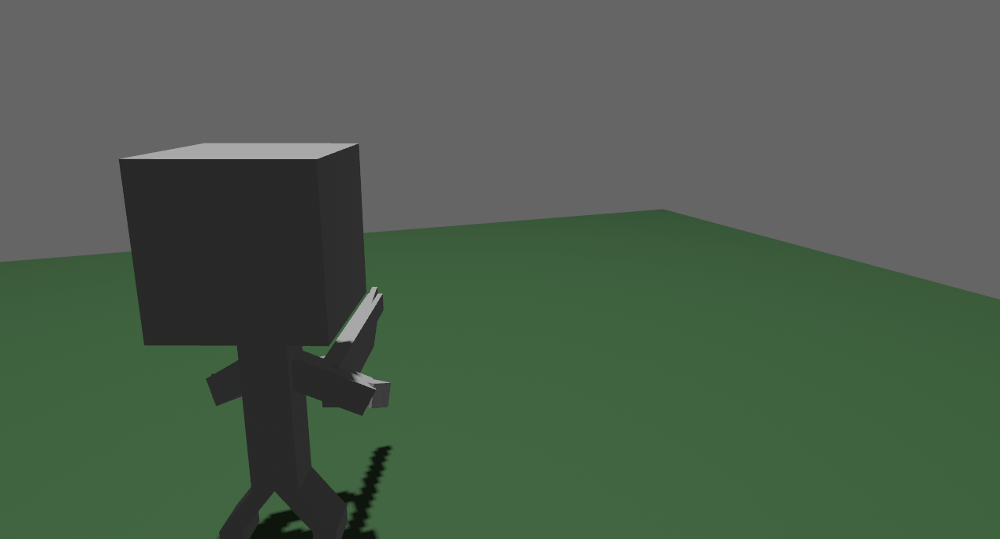

# Bevy Third Person Camera

- Aim
- Zoom in/out
- Orbit
- Custom Offset
- Cursor Lock
- Custom Sensitivity
- Full Gamepad Support!


## Getting Started

Add the **bevy_third_person_camera** crate: 

```
cargo add bevy_third_person_camera
```

Add the **ThirdPersonPlugin**: 

```rust
.add_plugins(ThirdPersonCameraPlugin)
```

Add the **ThirdPersonCamera** component to the camera entity: 

```rust
commands.spawn((
    ThirdPersonCamera::default(),
    Camera3dBundle::default()
));
```

Add the **ThirdPersonCameraTarget** component to your player:

```rust
// Player
commands.spawn((
    PbrBundle {
        mesh: meshes.add(Mesh::from(shape::Cube::new(1.0))),
        material: materials.add(Color::BLUE.into()),
        transform: Transform::from_xyz(0.0, 0.5, 0.0),
        ..default()
    },
    ThirdPersonCameraTarget,
    Player,
));
```

That's it! 

## Examples

- default
- custom

```
cargo run --example <example name>
```

## Features

### Offset

The `offset` will 'offset' the x and y values of the camera respectively. Offset is disabled by default. Turn on with `offset_enabled: true` 

```rust
offset_enabled: true,
offset: Offset::new(0.5, 0.25),
offset_toggle_key: Some(KeyCode::T),
offset_toggle_speed: 5.0 // default
```



### Aim

Aiming is calculated using the `aim_zoom` & the `zoom.min` values. Please note that the actual zoom level will vary if you  change the `zoom.min` value, even if the `aim_zoom` value stays the same. Aiming is disabled by default. Turn on with `aim_enabled: true`

```rust
aim_enabled: true, // default
aim_speed: 3.0, // default
aim_zoom: 0.7, // default
aim_button: Some(MouseButton::Right), // default
zoom: Zoom::new(1.5, 3.0)
```


### Cursor Lock

The cursor lock feature allows the mouse cursor to toggle between a locked, hidden state, to an unlocked, visible state. When unlocked, the orbiting feature is disabled, thus allowing the cursor to move freely within the window without disrupting the camera's transform. This feature can be fully disabled by setting the **enable_cursor_lock_toggle** value to **false** and will keep the cursor locked and hidden.


### Orbit

Orbiting is enabled by default. However, you can set the `mouse_orbit_button_enabled` setting to `true` and the orbiting will only be active while the `mouse_orbit_button` is pressed.

## Custom Settings

Most settings can be overridden: 

```rust
let gamepad = Gamepad::new(0);
commands.spawn((
    // These are the default settings
    ThirdPersonCamera {
        aim_enabled: false,
        aim_button: Some(MouseButton::Right),
        aim_speed: 3.0,
        aim_zoom: 0.7,
        cursor_lock_toggle_enabled: true,
        cursor_lock_active: true,
        cursor_lock_key: KeyCode::Space,
        mouse_sensitivity: 2.0,
        mouse_orbit_button_enabled: false,
        mouse_orbit_button: MouseButton::Middle,
        offset_enabled: false,
        offset: Offset::new(0.5, 0.4),
        offset_toggle_speed: 5.0,
        offset_toggle_key: Some(KeyCode::T), // default is None
        zoom: Zoom::new(1.5, 3.0),
        zoom_sensitivity: 1.0,
        gamepad_settings: CustomGamepadSettings {
            aim_button: Some(GamepadButton::new(gamepad, GamepadButtonType::LeftTrigger2)),
            mouse_orbit_button: GamepadButton::new(gamepad, GamepadButtonType::LeftTrigger),
            x_sensitivity: 7.0,
            y_sensitivity: 4.0,
            offset_toggle_button: Some(GamepadButton::new(gamepad, GamepadButtonType::DPadRight)), // default is None
            zoom_in_button: GamepadButton::new(gamepad, GamepadButtonType::DPadUp),
            zoom_out_button: GamepadButton::new(gamepad, GamepadButtonType::DPadDown),
        },
        ..default()
    },
    Camera3dBundle::default(),
));
```

## Default Controls

|                    | Mouse/Keyboard      | Gamepad      | Enabled by Default |
| ------------------ | ------------------- | ------------ | ------------------ |
| Zoom In            | Scroll Up           | D Pad Up     | Yes                |
| Zoom Out           | Scroll Down         | D Pad Down   | Yes                |
| Aim                | Right Mouse Button  | Left Trigger | No                 |
| Toggle Offset      | E                   | D Pad Right  | No                 |
| Cursor Lock/Unlock | Space               | n/a          | Yes                |
| Orbit Button       | Middle Mouse Button | Left Bumper  | No                 |

## Bevy Version Compatibility

| bevy | bevy_third_person_camera |
| ---- | ------------------------ |
| 0.12 | 0.1.7 - 0.1.8            |
| 0.11 | 0.1.1 - 0.1.6            |

Refer to the [Changelog](Changelog.md) to view breaking changes and updates.

## License

- MIT License (LICENSE-MIT or http://opensource.org/licenses/MIT)
- Apache License, Version 2.0 (LICENSE-APACHE or http://www.apache.org/licenses/LICENSE-2.0)


