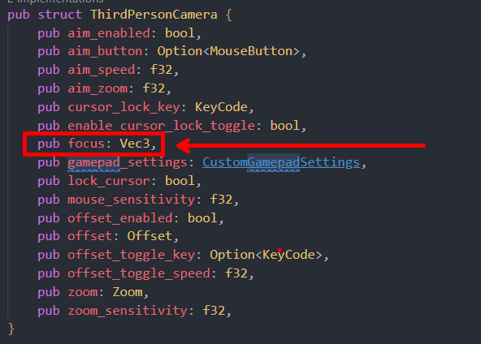

# v0.1.9 - v0.1.10 Breaking Changes Migration Guid

- Removed 'focus' field as it had zero effect
  - Fix: Remove any usage of the 'focus' field: 
    
- Renamed 'CustomGamepadSettings' to 'CameraGamepadSettings' for standardization
  - Fix: Rename any instances of 'CustomGamepadSettings' to 'CameraGamepadSettings'
- Moved 'CameraGamepadSettings', 'Offset' & 'Zoom' to 'Camera' module
  - Fix: If you are using any of these settings, you must import them from the 'camera' module
  ```rust 
    use bevy_third_person_camera::{camera::*, *};
  ```

